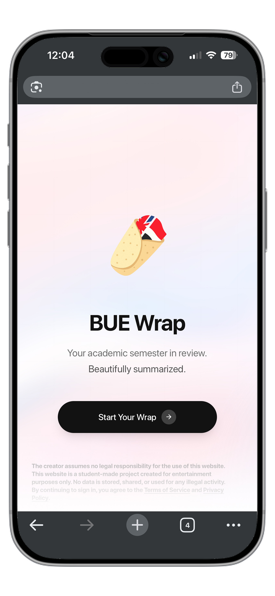

# BUEWrap (Portfolio Demo)

BUEWrap is a wrap-style React web app that presents an academic-semester summary experience.

<p align="center">  </p>

This public repository is configured as a standalone showcase build:
- No live backend dependency
- No real university login integration
- Test auth + mock data only

## Demo credentials

- Username: `demo.student`
- Password: `demo1234`

## Project structure

- `frontend/`: Vite React app (main showcase project)
- `backend/`: legacy prototype backend kept for reference only, not required for running the demo

## Run frontend locally

```bash
cd frontend
npm install
npm run dev
```

## Build frontend

```bash
cd frontend
npm run build
```

## Notes

- Share links are generated and resolved on the client side in demo mode.
- Do not use this demo with sensitive credentials or private data.

<!-- screenshots moved to top intro -->

*Built by MTarif www.mtarif.com*
